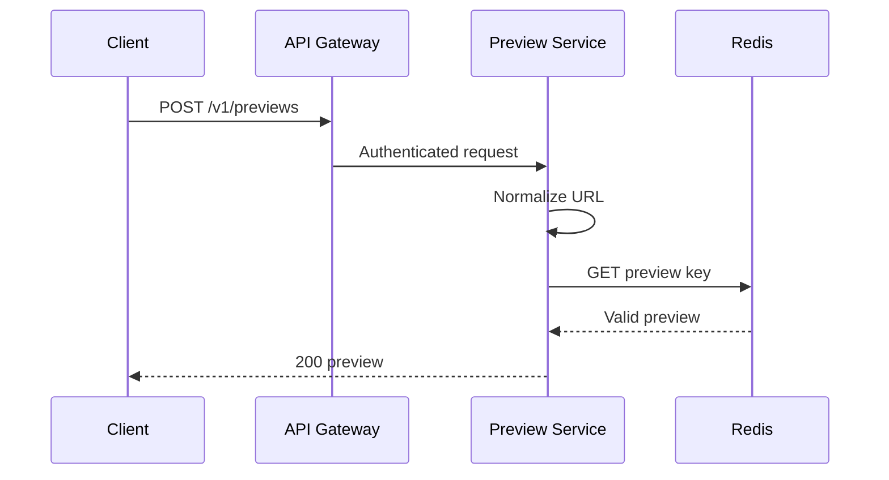
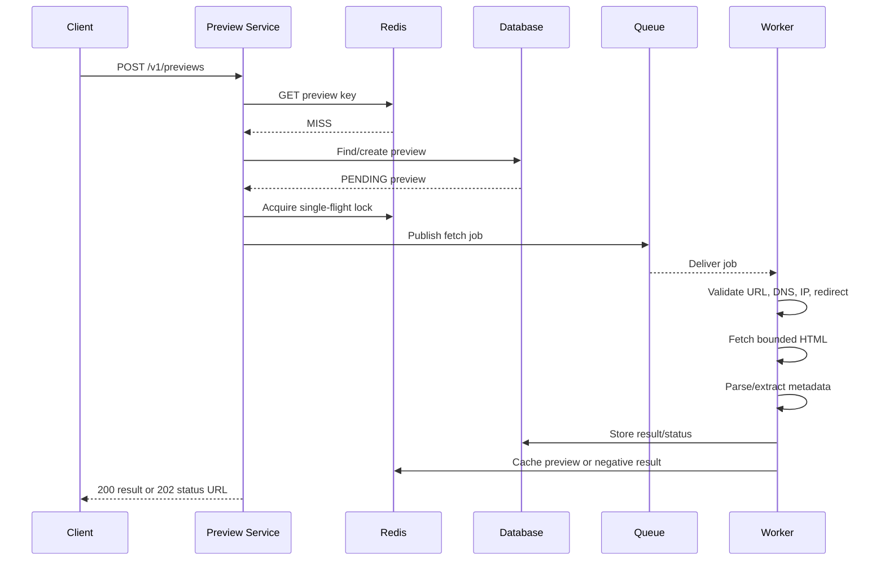
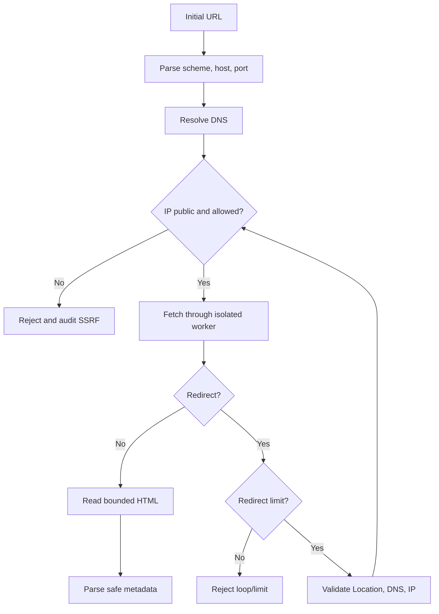

# CS-017 — URL Preview Service Data Flows

## Cache HIT

```mermaid
sequenceDiagram
    participant C as Client
    participant G as API Gateway
    participant P as Preview Service
    participant R as Redis
    C->>G: POST /v1/previews
    G->>P: Authenticated request
    P->>P: Normalize URL
    P->>R: GET preview key
    R-->>P: Valid preview
    P-->>C: 200 preview
```

## Cache MISS

```mermaid
sequenceDiagram
    participant C as Client
    participant P as Preview Service
    participant R as Redis
    participant D as Database
    participant Q as Queue
    participant W as Worker
    C->>P: POST /v1/previews
    P->>R: GET preview key
    R-->>P: MISS
    P->>D: Find/create preview
    D-->>P: PENDING preview
    P->>R: Acquire single-flight lock
    P->>Q: Publish fetch job
    Q-->>W: Deliver job
    W->>W: Validate URL, DNS, IP, redirect
    W->>W: Fetch bounded HTML
    W->>W: Parse/extract metadata
    W->>D: Store result/status
    W->>R: Cache preview or negative result
    P-->>C: 200 result or 202 status URL
```

## Safe redirect flow

```mermaid
flowchart TD
    A[Initial URL] --> B[Parse scheme, host, port]
    B --> C[Resolve DNS]
    C --> D{IP public and allowed?}
    D -- No --> E[Reject and audit SSRF]
    D -- Yes --> F[Fetch through isolated worker]
    F --> G{Redirect?}
    G -- No --> H[Read bounded HTML]
    G -- Yes --> I{Redirect limit?}
    I -- No --> J[Reject loop/limit]
    I -- Yes --> K[Validate Location, DNS, IP]
    K --> D
    H --> L[Parse safe metadata]
```
