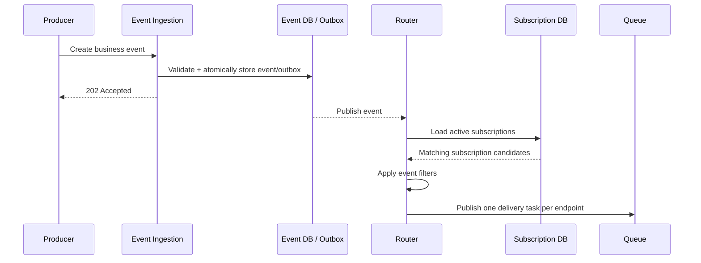
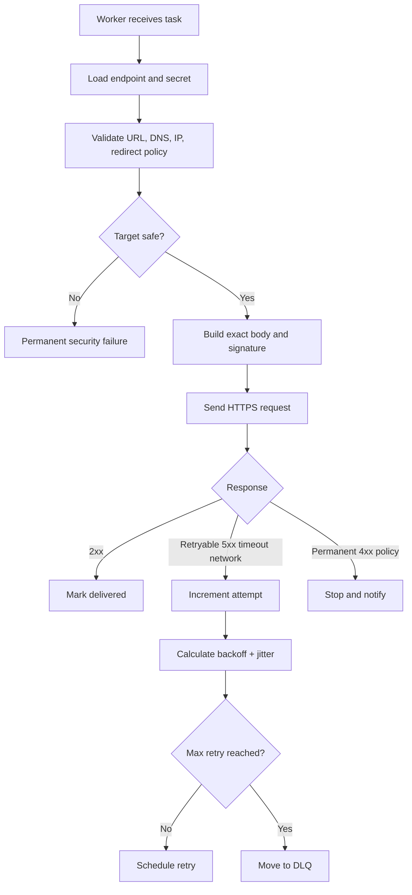
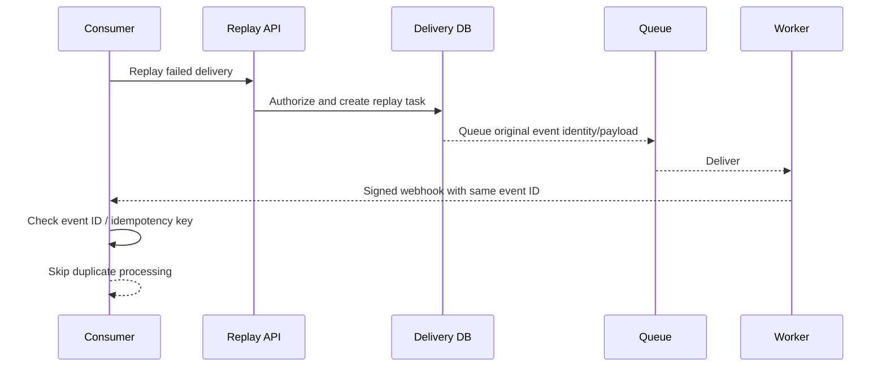
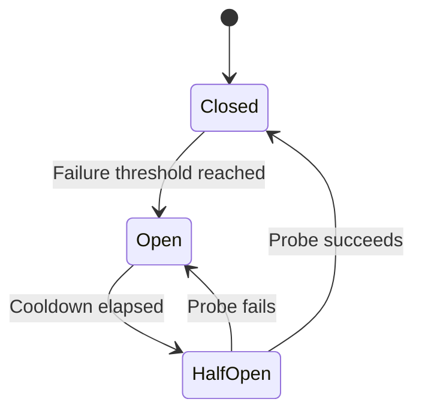

# CS-019 — Webhook Delivery Platform Data Flows

## Event ingestion and routing

```mermaid
sequenceDiagram
    participant P as Producer
    participant I as Event Ingestion
    participant E as Event DB / Outbox
    participant R as Router
    participant S as Subscription DB
    participant Q as Queue
    P->>I: Create business event
    I->>E: Validate + atomically store event/outbox
    I-->>P: 202 Accepted
    E-->>R: Publish event
    R->>S: Load active subscriptions
    S-->>R: Matching subscription candidates
    R->>R: Apply event filters
    R->>Q: Publish one delivery task per endpoint
```

## Delivery and retry

```mermaid
flowchart TD
    A[Worker receives task] --> B[Load endpoint and secret]
    B --> C[Validate URL, DNS, IP, redirect policy]
    C --> D{Target safe?}
    D -- No --> E[Permanent security failure]
    D -- Yes --> F[Build exact body and signature]
    F --> G[Send HTTPS request]
    G --> H{Response}
    H -- 2xx --> I[Mark delivered]
    H -- Retryable 5xx timeout network --> J[Increment attempt]
    J --> K[Calculate backoff + jitter]
    K --> L{Max retry reached?}
    L -- No --> M[Schedule retry]
    L -- Yes --> N[Move to DLQ]
    H -- Permanent 4xx policy --> O[Stop and notify]
```

## Duplicate replay

```mermaid
sequenceDiagram
    participant C as Consumer
    participant A as Replay API
    participant D as Delivery DB
    participant Q as Queue
    participant W as Worker
    C->>A: Replay failed delivery
    A->>D: Authorize and create replay task
    D-->>Q: Queue original event identity/payload
    Q-->>W: Deliver
    W-->>C: Signed webhook with same event ID
    C->>C: Check event ID / idempotency key
    C-->>C: Skip duplicate processing
```

## Circuit breaker

```mermaid
stateDiagram-v2
    [*] --> Closed
    Closed --> Open: Failure threshold reached
    Open --> HalfOpen: Cooldown elapsed
    HalfOpen --> Closed: Probe succeeds
    HalfOpen --> Open: Probe fails
```
