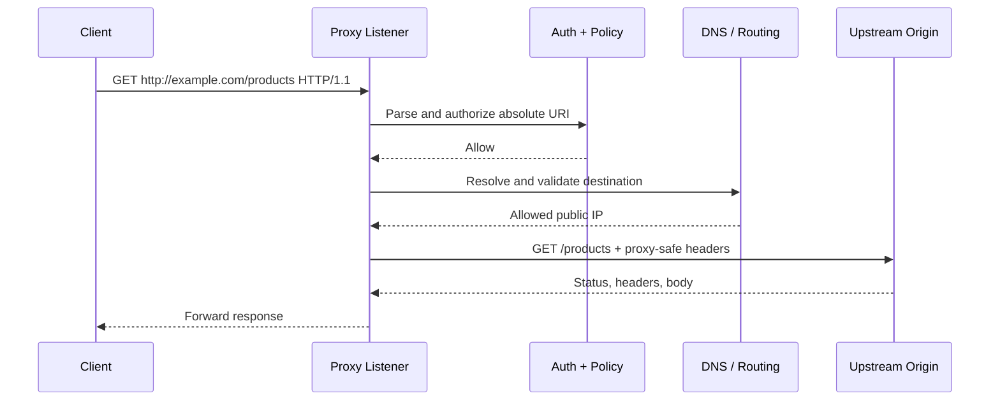
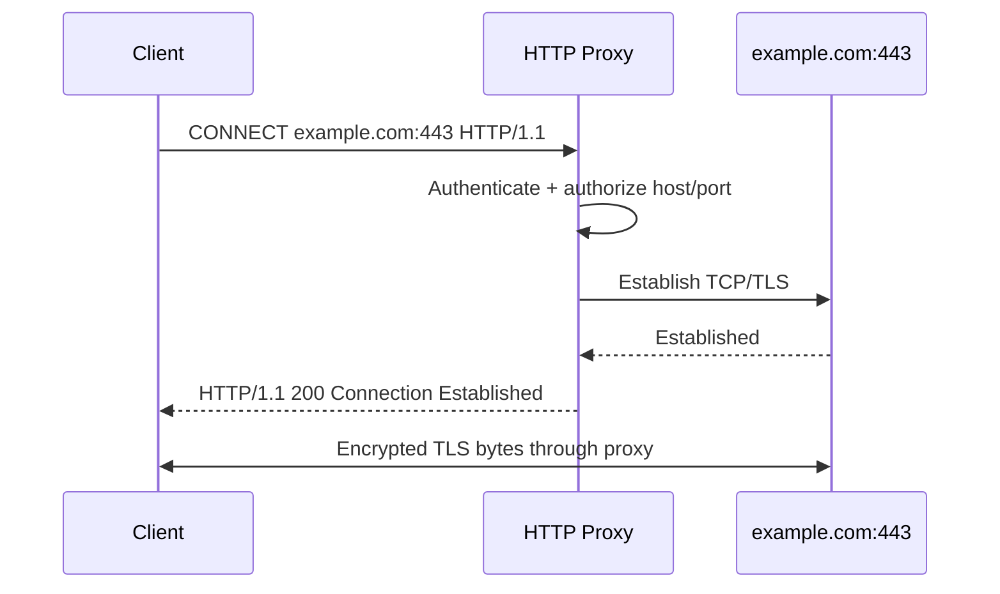
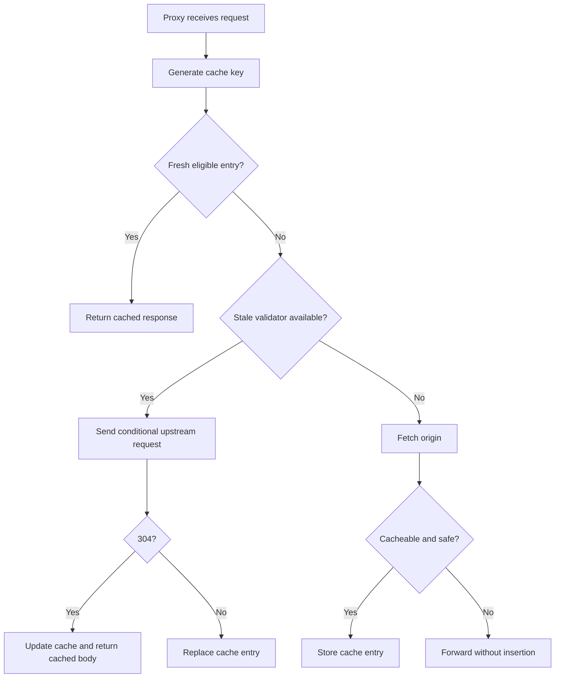

# CS-020 — HTTP Proxy Data Flows

## Plain HTTP forward request

```mermaid
sequenceDiagram
    participant C as Client
    participant L as Proxy Listener
    participant A as Auth + Policy
    participant D as DNS / Routing
    participant U as Upstream Origin
    C->>L: GET http://example.com/products HTTP/1.1
    L->>A: Parse and authorize absolute URI
    A-->>L: Allow
    L->>D: Resolve and validate destination
    D-->>L: Allowed public IP
    L->>U: GET /products + proxy-safe headers
    U-->>L: Status, headers, body
    L-->>C: Forward response
```

## HTTPS CONNECT tunnel

```mermaid
sequenceDiagram
    participant C as Client
    participant P as HTTP Proxy
    participant O as example.com:443
    C->>P: CONNECT example.com:443 HTTP/1.1
    P->>P: Authenticate + authorize host/port
    P->>O: Establish TCP/TLS
    O-->>P: Established
    P-->>C: HTTP/1.1 200 Connection Established
    C<<->>O: Encrypted TLS bytes through proxy
```

## Cache HIT and MISS

```mermaid
flowchart TD
    A[Proxy receives request] --> B[Generate cache key]
    B --> C{Fresh eligible entry?}
    C -- Yes --> D[Return cached response]
    C -- No --> E{Stale validator available?}
    E -- Yes --> F[Send conditional upstream request]
    F --> G{304?}
    G -- Yes --> H[Update cache and return cached body]
    G -- No --> I[Replace cache entry]
    E -- No --> J[Fetch origin]
    J --> K{Cacheable and safe?}
    K -- Yes --> L[Store cache entry]
    K -- No --> M[Forward without insertion]
```
