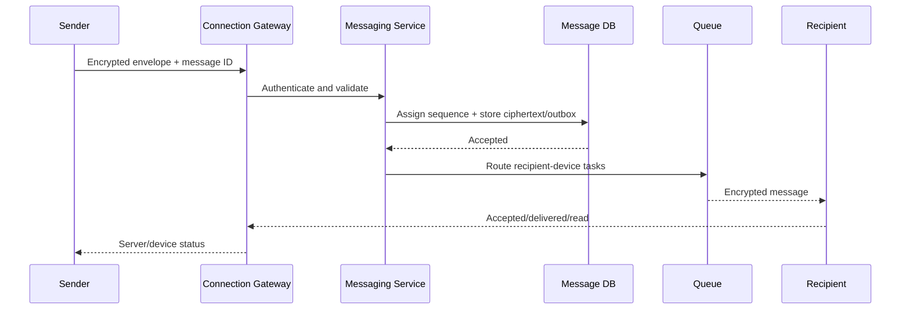
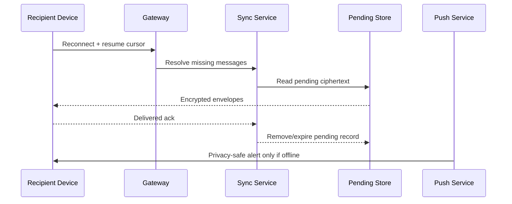
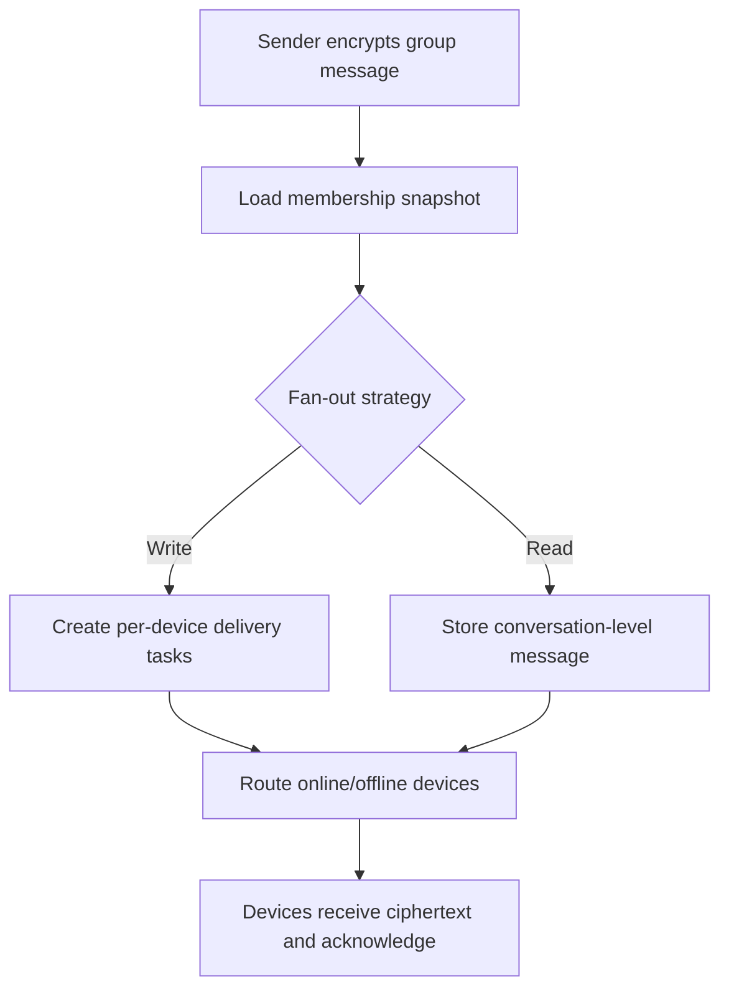
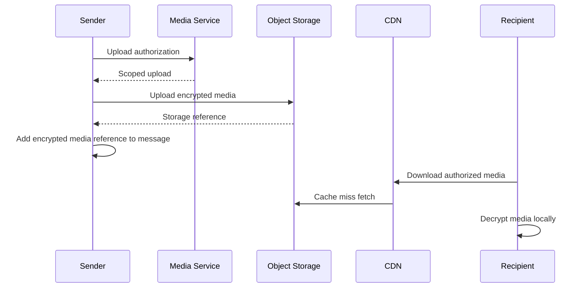

# CS-021 — WhatsApp-like Messaging Data Flows

## Online one-to-one message

```mermaid
sequenceDiagram
    participant S as Sender
    participant G as Connection Gateway
    participant M as Messaging Service
    participant D as Message DB
    participant Q as Queue
    participant R as Recipient
    S->>G: Encrypted envelope + message ID
    G->>M: Authenticate and validate
    M->>D: Assign sequence + store ciphertext/outbox
    D-->>M: Accepted
    M->>Q: Route recipient-device tasks
    Q-->>R: Encrypted message
    R-->>G: Accepted/delivered/read
    G-->>S: Server/device status
```

## Offline synchronization

```mermaid
sequenceDiagram
    participant R as Recipient Device
    participant G as Gateway
    participant S as Sync Service
    participant Q as Pending Store
    participant P as Push Service
    R->>G: Reconnect + resume cursor
    G->>S: Resolve missing messages
    S->>Q: Read pending ciphertext
    Q-->>R: Encrypted envelopes
    R-->>S: Delivered ack
    S-->>Q: Remove/expire pending record
    P->>R: Privacy-safe alert only if offline
```

## Group fan-out

```mermaid
flowchart TD
    A[Sender encrypts group message] --> B[Load membership snapshot]
    B --> C{Fan-out strategy}
    C -- Write --> D[Create per-device delivery tasks]
    C -- Read --> E[Store conversation-level message]
    D --> F[Route online/offline devices]
    E --> F
    F --> G[Devices receive ciphertext and acknowledge]
```

## Media delivery

```mermaid
sequenceDiagram
    participant C as Sender
    participant M as Media Service
    participant O as Object Storage
    participant D as CDN
    participant R as Recipient
    C->>M: Upload authorization
    M-->>C: Scoped upload
    C->>O: Upload encrypted media
    O-->>C: Storage reference
    C->>C: Add encrypted media reference to message
    R->>D: Download authorized media
    D->>O: Cache miss fetch
    R->>R: Decrypt media locally
```
